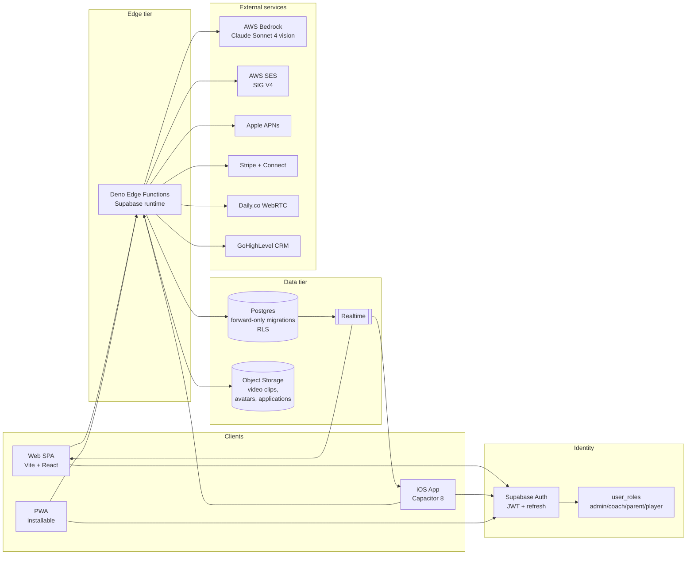
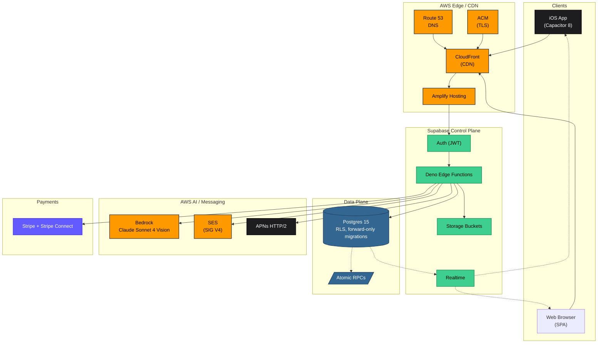
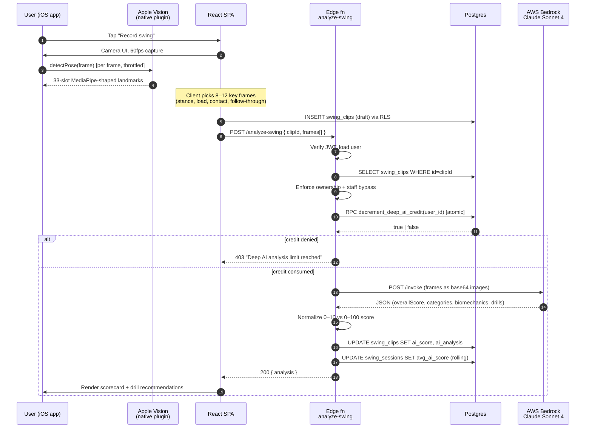
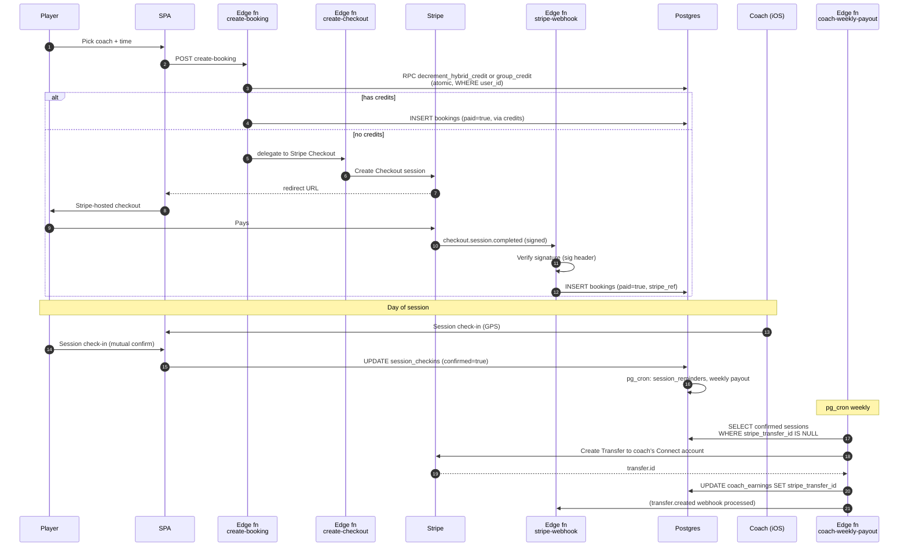
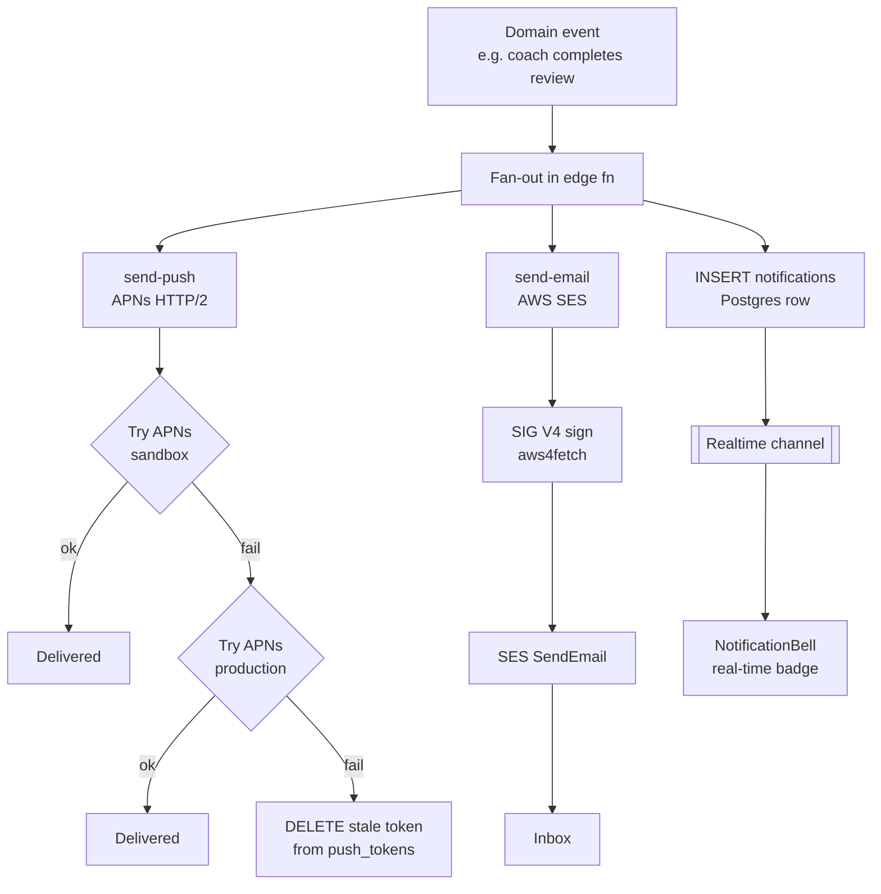
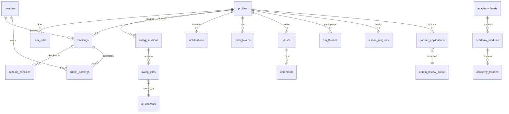
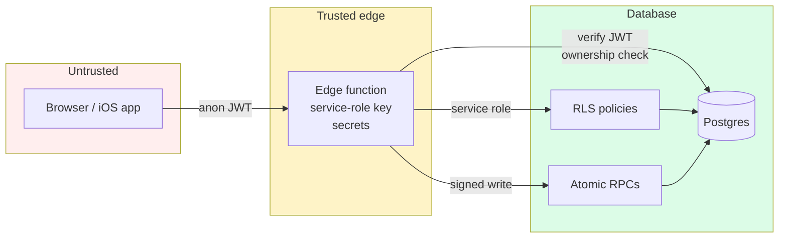

# Swing Institute — System Architecture

> Technical deep-dive. Everything on this page reflects what is actually deployed today, not a whiteboard future.

**Verified against the codebase on 2026-08-31.** Every count below is measured, not estimated — see [System scale](#0-system-scale) for how each was obtained.

## Table of contents

0. [System scale](#0-system-scale)
1. [Context & goals](#1-context--goals)
2. [Logical architecture](#2-logical-architecture)
3. [Physical architecture (AWS + Supabase)](#3-physical-architecture-aws--supabase)
4. [Request flow: AI swing analysis](#4-request-flow-ai-swing-analysis-hero-path)
5. [Request flow: Coaching session & payout](#5-request-flow-coaching-session--payout)
6. [Request flow: 3-channel notification](#6-request-flow-3-channel-notification)
7. [Data model](#7-data-model)
8. [Trust boundaries & security](#8-trust-boundaries--security)
9. [Scalability & cost posture](#9-scalability--cost-posture)
10. [Observability](#10-observability)
11. [Quality gates & CI](#11-quality-gates--ci)

---

## 0. System scale

**A snapshot, not a live figure.** This is a documentation mirror with no checkout behind it,
so the numbers are written out — dated, because they move faster than this page does.

| Metric | As of 2026-09-25 |
|---|---:|
| Commits on `main` | **1,888** |
| Non-merge commits | **1,681** |
| Development span | **2026-04-04 → 2026-09-25** |
| Deno edge functions | **115** |
| Postgres migrations | **408** |
| React route pages | **200** |
| — of which admin pages | **44** |
| React components | **549** |
| Custom hooks | **95** |
| Test files | **484** |

> **Read these as orders of magnitude.** An earlier revision of this page quoted 35 edge
> functions and 89 migrations — right when written, off by 2–3× four months later. The
> revision after that paired each count with the command producing it; twenty-five days on,
> every one of those figures had moved again (edge functions 101 → 115, migrations 296 → 408).
>
> In the application repo the rule is now that a drifting number is not written down at all —
> only the command that prints it, enforced by a blocking CI gate. That rule cannot apply here,
> because this repo holds documentation and no code to run commands against. The honest
> substitute is a date on the table and this paragraph telling you to distrust the precision.

---

## 1. Context & goals

**Users:** youth, HS, college, and MLB athletes (and their parents); independent baseball coaches running sessions; admin staff; affiliates/ambassadors/NIL partners.

**Functional goals:**
- Record a swing on a phone, get MLB-benchmarked feedback in under 15 seconds.
- Book and pay for a coaching session (virtual or in-person) and trigger an auto-payout to the coach after the session is mutually confirmed.
- Deliver a single product across web, iOS App Store, and PWA without a parallel mobile codebase.
- Run an admin/operations surface strong enough to launch the business.

**Non-functional goals:**
- Single TypeScript codebase, no native rewrite.
- < $250/mo infra at launch scale (< 500 MAU), predictable growth curve.
- Defense-in-depth: RLS + JWT + ownership checks + atomic RPCs + grant-level lockdown.
- Zero-downtime schema evolution: forward-only migrations, never edited after apply.
- Minimum-vendor surface: Supabase for OLTP + auth, AWS for heavy lifting (Bedrock, SES, CloudFront/Amplify, APNs), Stripe for money movement.
- COPPA-safe by construction: the platform knowingly serves minors, so age gating, private media, and parental consent are architectural constraints rather than features.

**Stage.** Pre-launch. The platform is built and deployed with ~0 real members, hardening toward public launch. Where this document describes traction, it describes none: the "1,200 athletes" figure in marketing copy is the number Jasha has trained **in person**, not an app-user count (`memory/decisions.md`, 2026-05-30).

---

## 2. Logical architecture

Three compute tiers, one data tier, one identity plane.



### Key characteristics

- **One codebase, three clients.** The iOS app is a Capacitor shell around the same Vite build; platform-specific branches are guarded by `Capacitor.isNativePlatform()`.
- **Edge-first backend.** No traditional application server. All server-side work runs in Deno edge functions (sub-100 ms cold start, global region). This drops the operational surface to near zero.
- **Postgres as the source of truth.** Row-Level Security enforces tenancy at the database layer, not the application layer. The service-role key never leaves edge functions.
- **Identity is separate from authorization.** Supabase Auth issues JWTs; the `user_roles` table — with RLS-protected read and an admin-only mutation path — decides what each identity can do.

---

## 3. Physical architecture (AWS + Supabase)

Mermaid `flowchart` with branded fill colors (AWS orange, Supabase green, Stripe purple, Postgres blue, Apple charcoal). For a hero-grade static asset using the official AWS Architecture Icons, see the note at the end of this section.



> **Want the hero-grade version with real AWS icons?** GitHub's Mermaid renderer doesn't load external icon registries (iconify, simple-icons). For a publish-quality architecture diagram with the official AWS Architecture Icons, build it once in [Excalidraw](https://excalidraw.com) (has an AWS icon library plugin) or [draw.io](https://app.diagrams.net) (full AWS shape stencil under "More Shapes → Networking → AWS"), export to PNG/SVG, and reference it inline:
>
> ```markdown
> 
> ```
>
> Source set: <https://aws.amazon.com/architecture/icons/>

### Service roles

| Layer | Service | Role |
|---|---|---|
| DNS + TLS | Route 53, ACM | Apex DNS, auto-renewed cert |
| CDN | CloudFront (via Amplify) | Static asset caching, HTTPS termination |
| Hosting | AWS Amplify | CI/CD from GitHub → S3 behind CloudFront, preview branches |
| Auth | Supabase Auth | JWT issuance, refresh rotation, email + Apple SSO |
| API | Supabase Edge Functions (Deno) | All server-side logic, 35 functions |
| OLTP | Supabase Postgres | Forward-only migrations, RLS everywhere, pg_cron for scheduled jobs |
| Realtime | Supabase Realtime | Push DB changes to subscribed clients (notifications, presence) |
| Object storage | Supabase Storage | Video clips, avatars, partner-application intro videos (100 MB cap) |
| AI inference | AWS Bedrock | Claude Sonnet 4 vision, via `aws4fetch` SIG V4 signing |
| Transactional email | AWS SES | 80+ branded templates, SIG V4 signed from Deno |
| Push | Apple APNs direct | HTTP/2, JWT auth, dual endpoint retry (sandbox + prod) |
| Payments | Stripe + Stripe Connect Express | Checkout, subscriptions, coach payouts |
| Live video | Daily.co | WebRTC rooms + transcription |
| CRM | GoHighLevel | Contact sync on signup |
| Error tracking | Sentry | Browser + edge-function errors (PII-scrubbed; minors excluded entirely) |
| Background checks | Checkr | Coach criminal-background screening before marketplace activation |
| Identity verification | Stripe Identity | Government-ID verification for coaches taking payouts |
| SMS | AWS SNS | Marketplace transactional SMS (ADR-0001) |
| Uptime | External dead-man's switch | Fires if the internal canary itself stops reporting |

### Subsystem map

The platform is larger than the hero AI path. The edge functions cluster into eight subsystems (counts below are shape, not inventory — run the command in §0 for the current total):

| Subsystem | Functions | What it owns |
|---|---:|---|
| **Marketplace** | ~18 | Coach search, listings, availability, booking requests, acceptance windows, en-route/check-in, disputes, reviews, reputation, lifecycle sweepers |
| **Money** | ~15 | Checkout, Connect onboarding, webhooks, refunds, payouts, reconciliation (both platform and marketplace), idempotency |
| **Notifications** | ~10 | Push, email, in-app, waitlist promotion, review-complete, critical alerts |
| **Swing / AI** | ~8 | Analysis, pose extraction + backfill, thumbnails, session video processing, clip sharing |
| **Trust & safety** | ~7 | Background checks, identity verification, coach certification, COPPA verification, child accounts, account deletion |
| **Growth / CRM** | ~10 | GHL sync, lead cadence, affiliate invites, referral credit, city waitlists, unsubscribe |
| **Scheduled ops** | ~15 | 15+ `pg_cron`-driven sweepers — attendance, SLA, expiry, balance, score-pending, stripe-connect status |
| **Platform** | ~8 | Health, canary, availability, distance, transcription, Zoom/Daily rooms |

**Why so many sweepers.** Every multi-step business process that can stall — an unaccepted booking request, an unresolved dispute, an expiring credit, a coach who never finished Connect onboarding — has a scheduled function that finds stalled rows and advances or expires them. This is the "no manual queues" goal from the product brief expressed in architecture: the operator gets an alert, not a to-do list.

---

## 4. Request flow: AI swing analysis (hero path)

The central product loop — a 30-second clip on a phone becomes a structured biomechanical scorecard.



### Why this shape

- **Client-side frame extraction** keeps Bedrock bills low: we send 8–12 JPEGs, not a 30-second MP4. Cost scales with key frames, not video length.
- **Dual pose pipeline** (Apple Vision on iOS 14+, MediaPipe Tasks Vision on web) behind the same `PoseLandmark[33]` shape. The iOS native plugin synthesizes the MediaPipe index layout so downstream JS has one code path regardless of source.
- **Atomic credit decrement via RPC.** Read-then-write on `deep_ai_credits_remaining` would race under concurrent uploads. The RPC does `UPDATE ... WHERE credits > 0 RETURNING credits` in a single statement — either you got the credit or you didn't.
- **Staff bypass** (admin/coach) is evaluated server-side inside the function, not client-side — impossible to forge from the browser.
- **Structured output contract.** The system prompt defines a strict JSON schema with MLB biomechanical benchmarks baked in. The function parses and normalizes before persisting. If Bedrock returns malformed JSON, we return a 500 and do not update the clip — the credit decrement is the only side effect, and that's acceptable because Bedrock was billed.

Source: [supabase/functions/analyze-swing/index.ts](https://github.com/jashabalcom/swinginsitute/blob/main/supabase/functions/analyze-swing/index.ts), [src/plugins/PoseDetector.ts](https://github.com/jashabalcom/swinginsitute/blob/main/src/plugins/PoseDetector.ts), [ios/App/App/PoseDetectorPlugin.swift](https://github.com/jashabalcom/swinginsitute/blob/main/ios/App/App/PoseDetectorPlugin.swift).

---

## 5. Request flow: Coaching session & payout

End-to-end money movement — from checkout to coach bank transfer — without a single application server.



### Why this shape

- **Credit-first, money-second.** If a player has credits on a hybrid or group plan, we burn those first via atomic RPC before touching Stripe. One round-trip, one consistent state.
- **Webhooks are the source of truth for payment.** The client-side "payment success" screen is a convenience — the actual mutation happens from Stripe → webhook → DB. The `verify-checkout` function covers the browser-closed-before-redirect case.
- **Payout is a scheduled job, not a per-session operation.** `pg_cron` runs `process-coach-payouts` weekly and aggregates all confirmed sessions without a `stripe_transfer_id`. This keeps Stripe API calls bounded and makes the operation idempotent — if a run partially fails, the next run picks up the rest.
- **Mutual confirmation is the payout trigger.** A coach saying "I showed up" is not enough; the player must also confirm. This is a fraud guard and a dispute-avoidance mechanism.

Source: [supabase/functions/create-booking/index.ts](https://github.com/jashabalcom/swinginsitute/blob/main/supabase/functions/create-booking/index.ts), [supabase/functions/stripe-webhook/index.ts](https://github.com/jashabalcom/swinginsitute/blob/main/supabase/functions/stripe-webhook/index.ts), [supabase/functions/coach-weekly-payout/index.ts](https://github.com/jashabalcom/swinginsitute/blob/main/supabase/functions/coach-weekly-payout/index.ts), [supabase/functions/process-coach-payouts/index.ts](https://github.com/jashabalcom/swinginsitute/blob/main/supabase/functions/process-coach-payouts/index.ts).

---

## 6. Request flow: 3-channel notification

Every user-facing event (coach feedback, new DM, session reminder, admin alert) fires to **push + email + in-app row** in parallel. One source of truth, three delivery paths.



### Why this shape

- **Dual APNs endpoint retry.** Apple tokens drift between sandbox and production builds. Trying both, then cleaning up dead tokens, is the reliability trick that gets this system to ~100% delivery in prod telemetry.
- **Listeners before register.** Capacitor's push plugin is order-sensitive: listeners must be attached before `PushNotifications.register()`. This is documented in `CLAUDE.md` and enforced by a protected-file marker because it has broken before.
- **Delete-then-insert on token rotation.** APNs tokens are opaque; storing the most recent for a user and blowing away the old is simpler and safer than upsert-by-token.
- **Fan-out is fire-and-forget from the app's perspective.** The calling edge function awaits `Promise.allSettled` — one channel's failure does not block the others.

Source: [supabase/functions/send-push/index.ts](https://github.com/jashabalcom/swinginsitute/blob/main/supabase/functions/send-push/index.ts), [supabase/functions/send-email/index.ts](https://github.com/jashabalcom/swinginsitute/blob/main/supabase/functions/send-email/index.ts), [src/hooks/usePushNotifications.ts](https://github.com/jashabalcom/swinginsitute/blob/main/src/hooks/usePushNotifications.ts), [src/components/community/NotificationBell.tsx](https://github.com/jashabalcom/swinginsitute/blob/main/src/components/community/NotificationBell.tsx).

---

## 7. Data model

~50 tables across auth, coaching, academy, commerce, and community. Key relationships:



### Design decisions worth noting

- **Single `partner_applications` table with a `program` discriminator** (coach / nil / ambassador / affiliate) instead of four parallel tables. Saves schema duplication and lets a single admin queue handle all four.
- **`user_roles` is append-only in practice.** Role escalation goes through admin RPCs, not direct table writes. Players never see their own role row.
- **`swing_clips.ai_analysis` is JSONB.** The Bedrock output shape evolves quarterly; denormalizing would force a migration each time. Category scores are extracted to typed columns for indexing (`ai_score`, `ai_analyzed_at`).
- **`session_checkins` stores GPS coords** when available. Not required (virtual sessions have none) but feeds the launch-readiness check for in-person verification.
- **`business_rules` is a table, not a constants file.** Price floors, referral rates, SLA windows, and canary alert thresholds live in the database so the operator can change them without a deploy. The canary reads from it deliberately — querying a real business rule proves the table *and* its RLS are healthy, not just that Postgres accepts connections.
- **`member_directory` is a view, not a table.** It is the only sanctioned path for one member to read another's profile fields. The underlying `profiles` table holds minors' legal names, ages, and parent contact details and is no longer broadly selectable.

### Domains added since the first revision of this doc

The ERD above covers the original core. Four domains have since been built out and are worth naming because they carry most of the recent complexity:

- **Marketplace** — listings, availability, booking requests with acceptance windows, en-route/photo check-in, disputes with SLA resolution, reviews, coach reputation, marketplace-specific credits and payment reconciliation. Eleven migrations touch it directly.
- **Trust & safety** — Checkr background checks, Stripe Identity verification, coach certification, report/block on every UGC surface, DM filtering.
- **COPPA & family** — age gate, parent-verified child account creation, out-of-band parental consent email, per-minor privacy suppression, and a `process-account-deletions` path with a coverage ratchet so a new table cannot silently escape deletion.
- **Growth** — referral attribution and commission, affiliate invites, lead cadence automation, per-city waitlists with balance sweeping.

---

## 8. Trust boundaries & security



**Defense in depth:**

1. **Grant tier.** *(Added Aug 2026.)* RLS is not the outermost layer — Postgres `GRANT`/`REVOKE` is. `SECURITY DEFINER` functions bypass RLS entirely, so every privileged RPC is explicitly revoked from `PUBLIC` and `anon`. See [the anon-executable RPC finding](#the-grant-tier-lesson) below for why this layer earned its place.
2. **Database tier.** RLS policies on every user-scoped table. No table is readable/writable without explicit policy. The service-role key never leaves edge functions.
3. **Column tier.** *(Added Aug 2026.)* Table-level `GRANT SELECT` is too coarse for `profiles`, which holds children's legal names, ages, and parent contact details. Cross-user reads now route through a narrowed `member_directory` view; the base table's broad select grant was revoked behind it.
4. **Edge tier.** Every sensitive function verifies the incoming JWT with `supabase.auth.getUser(token)`, then re-checks resource ownership (e.g., `swing_clips.user_id = auth.uid()`) before acting. Authorization is never inferred from the client.
5. **Credit tier.** Any limited resource (AI analyses, hybrid credits, group credits, marketplace credits) decrements through an atomic RPC. No read-then-write paths. A user cannot race two concurrent requests into a free analysis.
6. **Payment tier.** Stripe webhooks verify the signature header before touching the DB. The reconciliation job reruns against Stripe's API to catch silent drops.
7. **Minor-safety tier.** *(Added 2026.)* The `swing-videos` bucket is private (`public=false`) with storage RLS scoped to owner / parent / assigned coach / admin; reads go through signed URLs. Ad/analytics pixels are suppressed on under-13 sessions, and Sentry does not record minors at all.
8. **iOS tier.** Native secrets (APNs key, Apple Sign In key) never reach JS; `Capacitor.Preferences` is used instead of `localStorage` on native for encrypted-at-rest session storage.
9. **Protected surfaces.** `CLAUDE.md` marks the notification system, credit RPCs, Stripe webhook, and SES config as change-controlled — they are production-verified and any modification requires explicit re-testing.

### The grant tier lesson

The 2026-08-15 launch audit surfaced a finding worth generalizing, because it is a *class* of bug rather than a typo. Specifics are held in the private repo; the transferable shape is this:

A `SECURITY DEFINER` function carried an authorization guard that deliberately allows callers with a NULL `auth.uid()` through, so that cron and service-role callers can use it. That pattern is sound **only when the anonymous role is separately revoked at the grant level.** Most functions using it had that revoke. A few, added in later migrations, granted execute to the authenticated role and never revoked the default — and because new public-schema functions are auto-granted to the anonymous role, granting to `authenticated` restricted nothing.

Two properties combined to make it serious: `SECURITY DEFINER` bypasses RLS entirely, so correct table policies were irrelevant; and the anonymous key is, by design, public — it ships in the client bundle. The gap was closed before launch and verified at the privilege level afterward.

**Three architectural lessons, all now encoded in the project's pre-flight checks:**

- **A column-level `REVOKE` is a silent no-op while a table-level `GRANT` stands.** It returns success and changes nothing. Same for functions while `PUBLIC` holds the grant (ACL shows `=X/postgres`). The fix is always: revoke the broad grant, then re-grant the narrow set.
- **Never trust `{"success": true}` from a migration.** Verify with `has_column_privilege` / `has_function_privilege` *after* applying.
- **A safe pattern plus an unsafe default is an unsafe pattern.** The guard was fine; the platform's default grant behavior undid it. Defense in depth means the layers cannot assume each other.

### Two-stage rollout for a breaking security fix

Closing the `profiles` read hole was not a single migration, because the obvious version breaks login for every existing session:

- **Stage A** (2026-08-21) — migrate all **54** cross-user profile read sites in the frontend onto `member_directory`, and ship that build. No permission change; nothing breaks.
- **Stage B** (2026-08-22) — only once the narrowed frontend is live, revoke the broad `profiles` select grant.

Order is load-bearing and is called out in `CLAUDE.md` as the one hard dependency in the audit's fix plan: **the revoke must follow the frontend deploy, or login breaks.** Stage B's migration shipped with a test written to fail if the hole reopens.

---

## 9. Scalability & cost posture

### Launch tier (0–500 MAU, current)

| Service | Monthly |
|---|---|
| AWS Amplify + CloudFront | $5–15 |
| Supabase Pro | $25 |
| AWS Bedrock (Sonnet 4 vision, ~2k analyses/mo) | $40–80 |
| AWS SES | $1–5 |
| Stripe (2.9% + 30¢ per txn) | variable |
| Daily.co | $0 at launch volume |
| Sentry | free tier |
| **Baseline** | **~$75–130/mo** |

### Phase 2 migration (500–5000 MAU, planned in [AWS-DEPLOYMENT-PLAN.md](AWS-DEPLOYMENT-PLAN.md))

- Edge Functions → AWS Lambda behind API Gateway (keeps Deno runtime via `lambda-runtime-deno`)
- Postgres → Aurora PostgreSQL Serverless v2 with DMS cutover
- Storage → S3 direct (already using S3 semantics via Supabase's S3-compatible API)
- Auth → evaluate Cognito vs stay on Supabase Auth; Cognito free tier is 50k MAU
- Realtime → API Gateway WebSocket + DynamoDB Streams

Migration order is deliberate: frontend first (free), then auth (the riskiest cutover), then data, then functions. Data migration runs in parallel (AWS DMS does logical replication) with a final write cutover during low traffic.

### Bottlenecks and how they're addressed

| Bottleneck | Mitigation |
|---|---|
| Bedrock per-call latency (~4–8s) | Analysis is async-perceived — player sees "Analyzing…" state, realtime updates when done. |
| Video storage cost growth | 7-day retention via `storage-cleanup` cron; only clips with AI analysis are kept long-term. |
| APNs token staleness | Dual-endpoint retry + dead-token cleanup during each send. |
| Concurrent credit races | Atomic RPCs (`decrement_*_credit`) with `WHERE remaining > 0`. |
| Scheduled job failures | Idempotent design — every cron job is safe to rerun; `stripe_transfer_id IS NULL` predicate ensures no double-pay. |

---

## 10. Observability

- **Sentry** captures browser + edge-function errors; source maps uploaded in CI.
- **Postgres `health` edge function** returns JSON health of DB, SES reachability, Bedrock reachability — used by uptime pings.
- **`AdminLaunchReadiness` dashboard** ([src/pages/AdminLaunchReadiness.tsx](https://github.com/jashabalcom/swinginsitute/blob/main/src/pages/AdminLaunchReadiness.tsx)) runs 13 automated checks in-app: coach onboarded, Stripe transfer happened, mutual confirm happened, GPS captured, rating captured, partner applications, push tokens, pg_cron jobs running, orphan bookings, pending earnings age. Single pane of glass before a launch event.
- **pg_cron visibility** is queryable — the launch-readiness dashboard surfaces last-run timestamps for every scheduled job.
- **Stripe reconciliation** runs daily and alerts admins via the `admin-email-alerts` function if platform balance drifts from expected.

### Synthetic monitoring: the canary and the dead-man's switch

`canary-runner` executes every 5 minutes via `pg_cron` and times six synthetic checks of the critical paths:

1. `db_reachable` — `SELECT 1`
2. `business_rules_query` — reads a real business rule, proving the rules table *and* its RLS are intact
3. `messaging_provider_status` — the provider view is queryable
4. `attendance_reminder_sweeper` — function responds 2xx
5. `dispute_sla_resolver` — function responds 2xx
6. `compute_route_distance` — returns a sane distance for a known ATL route

Results land in `canary_runs`. After N consecutive failures (N is configurable in `business_rules`, not hardcoded) it fires a critical admin alert.

**The interesting part is the layer above it.** A monitor that lives inside the system it monitors cannot report that it is dead. So each canary run also pings an **external dead-man's switch** (`_shared/deadMansSwitch.ts`). If the whole Supabase project goes dark — taking the canary with it — the *absence* of that ping is what pages the operator. This is the difference between monitoring and observability that survives its own failure mode.

---

## 11. Quality gates & CI

CI is `.github/workflows/deploy.yml`. Two jobs: `quality` (runs on PRs *and* pushes to main) and `deploy` (push-only, guarded by `github.event_name` so a PR can never ship to Amplify).

**The gate chain, all blocking:**

| Gate | Command | Notes |
|---|---|---|
| Types | `node scripts/tsc-ratchet.mjs` | Baseline lives in `.tsc-baseline`; the script prints it |
| Lint | `node scripts/eslint-ratchet.mjs` | Baseline lives in `.eslint-baseline`; the script prints it |
| Frontend tests | `npm test` (vitest) | No `continue-on-error` — a red test blocks the merge |
| Edge types | `deno check` on `_shared/*.ts` | Type-checks clean today, so it is a real gate |
| Edge tests | `deno test` on `_shared` + `analyze-swing` | Runs with `--allow-env` (cors.ts reads env at module load) |
| Deploy drift | push-only, report-only | |

Playwright E2E is `continue-on-error` and gates nothing. Stated plainly because a documented gap is a known risk, while an undocumented one is a surprise during an incident.

### Ratchets, not thresholds

The raw tools are not the gate. `scripts/tsc-ratchet.mjs` and `scripts/eslint-ratchet.mjs` fail only when the error count **increases** past a committed baseline, and the baseline can only move down.

**Why.** The codebase carries real type and lint debt. A hard `--max-warnings 0` gate would be permanently red, and a permanently red gate is one everyone learns to ignore — the worst possible state. A ratchet is always green on a clean change and always red on a regression, which is exactly the signal a gate should carry. Paying down debt lowers the baseline; the file is committed, so improvement is visible in the diff.

Two traps worth knowing, both documented in `CLAUDE.md`:

- **Root `tsc --noEmit` is vacuous.** The root `tsconfig.json` is solution-style with `files: []`. The real check is `tsc -p tsconfig.app.json --noEmit`. A green root run means nothing.
- **Raw `eslint .` reports ~325 errors** because the ratchet counts a narrower set. Reading the raw number as a regression is a false alarm.

### The CI ordering trap

Step order in the quality job is load-bearing and commented as such in the workflow.

`deno check --node-modules-dir=auto` re-resolves the edge functions' `npm:@supabase/supabase-js@2` specifiers into the **shared** `node_modules`, installing the newest match for the caret range and clobbering what `npm ci` pinned. Observed: `@supabase/supabase-js` 2.90.1 → 2.111.0 and `typescript` 5.8.3 → 5.9.3. The two Supabase versions have different `SupabaseClient` generics, so a `tsc` run afterwards reports errors in `src/` files the diff never touched — the ratchet jumped **169 → 182**, blaming a changeset that added nothing.

Reproduced deterministically: `npm ci` → 169, `deno check` → 182, `npm ci` → 169.

**CI is safe only because every Node/tsc gate runs before every Deno gate.** Reordering reintroduces it, and the failure looks like a real regression, so it costs an afternoon to diagnose. `scripts/tsc-ratchet.mjs` now fails closed on the mismatch and names the fix. The same corruption rewrites `ios/App/CapApp-SPM/Package.swift` to point at `node_modules/.deno/…` paths that exist on no other machine — never commit that file after a Deno run.

> This is the most quietly senior thing in the repo: a build-tooling interaction that produces a *plausible false signal*, diagnosed to root cause, then encoded as a fail-closed check plus a comment in the workflow so the next person cannot lose the same afternoon.

---

## Further reading

- [ENGINEERING-DECISIONS.md](ENGINEERING-DECISIONS.md) — ADRs behind these choices
- [BUILD-TIMELINE.md](BUILD-TIMELINE.md) — how the architecture evolved
- the internal launch audit (private repo) — the audit behind the security sections above
- [AWS-DEPLOYMENT-PLAN.md](AWS-DEPLOYMENT-PLAN.md) — phased migration plan to AWS-native
