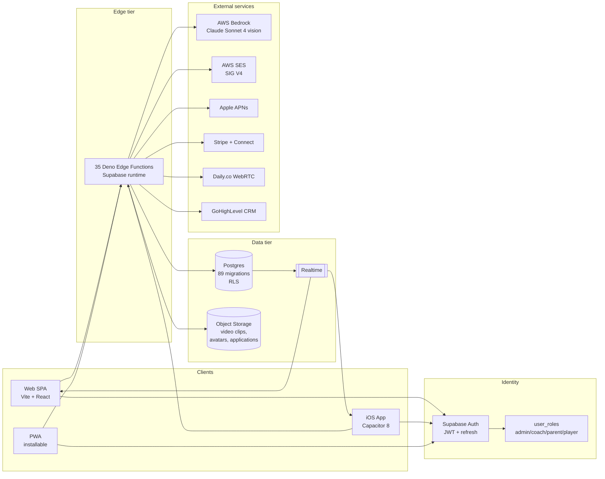
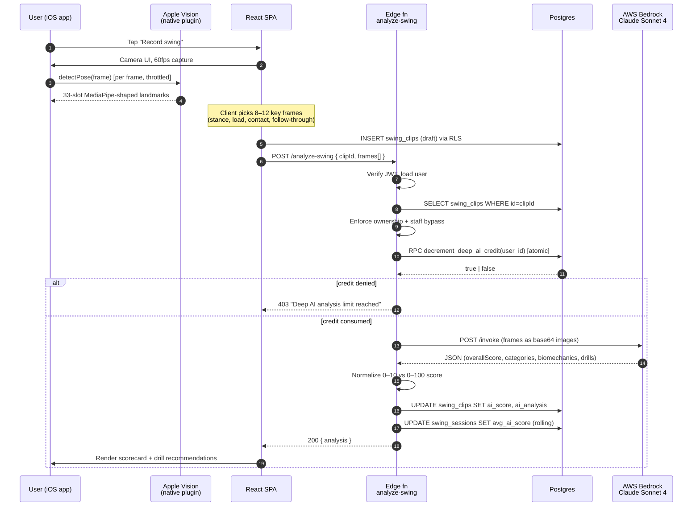
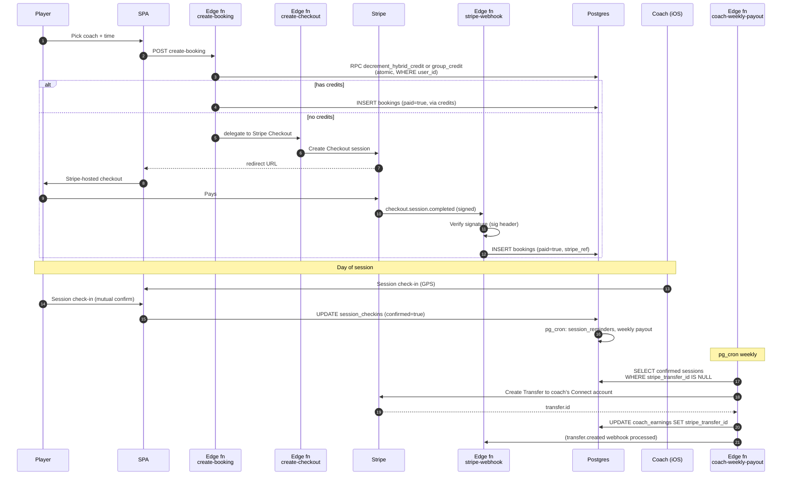
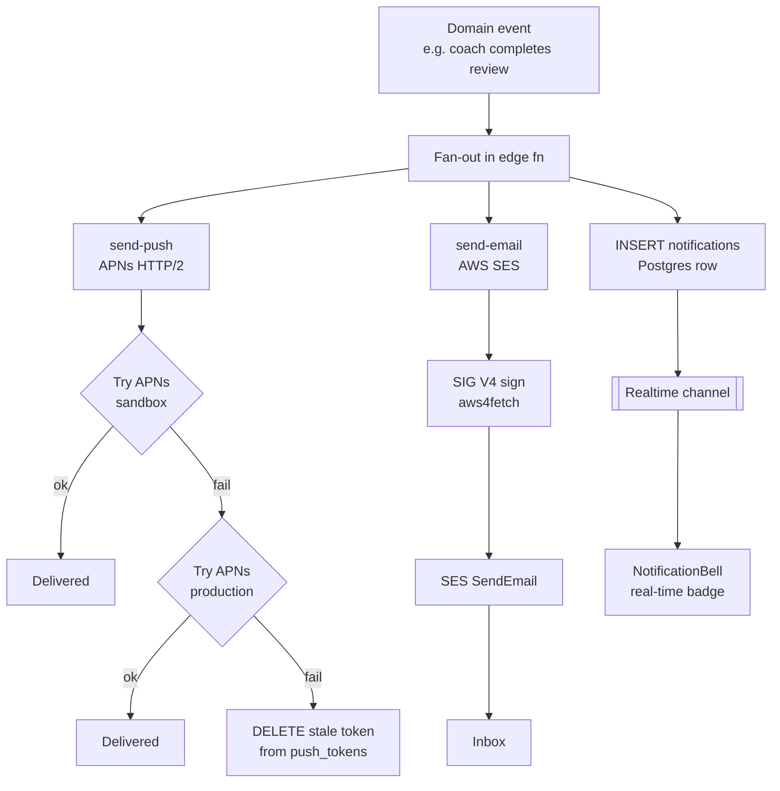
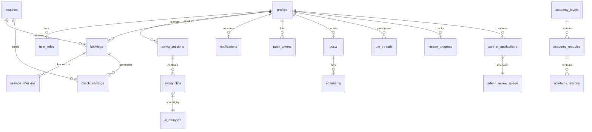
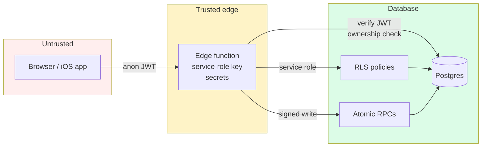

# Swing Institute — System Architecture

> Deep-dive for engineers, architects, and hiring managers. Everything on this page reflects what is actually deployed today, not a whiteboard future.

## Table of contents

1. [Context & goals](#1-context--goals)
2. [Logical architecture](#2-logical-architecture)
3. [Physical architecture (AWS + Supabase)](#3-physical-architecture-aws--supabase)
4. [Request flow: AI swing analysis](#4-request-flow-ai-swing-analysis-hero-path)
5. [Request flow: Coaching session & payout](#5-request-flow-coaching-session--payout)
6. [Request flow: 3-channel notification](#6-request-flow-3-channel-notification)
7. [Data model](#7-data-model)
8. [Trust boundaries & security](#8-trust-boundaries--security)
9. [Scalability & cost posture](#9-scalability--cost-posture)
10. [Observability](#10-observability)

---

## 1. Context & goals

**Users:** youth, HS, college, and MLB athletes (and their parents); independent baseball coaches running sessions; admin staff; affiliates/ambassadors/NIL partners.

**Functional goals:**
- Record a swing on a phone, get MLB-benchmarked feedback in under 15 seconds.
- Book and pay for a coaching session (virtual or in-person) and trigger an auto-payout to the coach after the session is mutually confirmed.
- Deliver a single product across web, iOS App Store, and PWA without a parallel mobile codebase.
- Run an admin/operations surface strong enough to launch the business.

**Non-functional goals:**
- Single TypeScript codebase, no native rewrite.
- < $250/mo infra at launch scale (< 500 MAU), predictable growth curve.
- Defense-in-depth: RLS + JWT + ownership checks + atomic RPCs.
- Zero-downtime schema evolution (89 forward-only migrations).
- Minimum-vendor surface: Supabase for OLTP + auth, AWS for heavy lifting (Bedrock, SES, CloudFront/Amplify, APNs), Stripe for money movement.

---

## 2. Logical architecture

Three compute tiers, one data tier, one identity plane.

### Key characteristics

- **One codebase, three clients.** The iOS app is a Capacitor shell around the same Vite build; platform-specific branches are guarded by `Capacitor.isNativePlatform()`.
- **Edge-first backend.** No traditional application server. All server-side work runs in Deno edge functions (sub-100 ms cold start, global region). This drops the operational surface to near zero.
- **Postgres as the source of truth.** Row-Level Security enforces tenancy at the database layer, not the application layer. The service-role key never leaves edge functions.
- **Identity is separate from authorization.** Supabase Auth issues JWTs; the `user_roles` table — with RLS-protected read and an admin-only mutation path — decides what each identity can do.

---

## 3. Physical architecture (AWS + Supabase)

Below uses Mermaid's `architecture-beta` with iconify AWS icon pack — GitHub renders these natively.

> AWS Architecture Icons reference: the official set (PNG + SVG) is distributed by AWS at <https://aws.amazon.com/architecture/icons/>. Mermaid `architecture-beta` uses the iconify mirror for inline rendering.

### Service roles

| Layer | Service | Role |
|---|---|---|
| DNS + TLS | Route 53, ACM | Apex DNS, auto-renewed cert |
| CDN | CloudFront (via Amplify) | Static asset caching, HTTPS termination |
| Hosting | AWS Amplify | CI/CD from GitHub → S3 behind CloudFront, preview branches |
| Auth | Supabase Auth | JWT issuance, refresh rotation, email + Apple SSO |
| API | Supabase Edge Functions (Deno) | All server-side logic, 35 functions |
| OLTP | Supabase Postgres | 89 migrations, RLS everywhere, pg_cron for scheduled jobs |
| Realtime | Supabase Realtime | Push DB changes to subscribed clients (notifications, presence) |
| Object storage | Supabase Storage | Video clips, avatars, partner-application intro videos (100 MB cap) |
| AI inference | AWS Bedrock | Claude Sonnet 4 vision, via `aws4fetch` SIG V4 signing |
| Transactional email | AWS SES | 80+ branded templates, SIG V4 signed from Deno |
| Push | Apple APNs direct | HTTP/2, JWT auth, dual endpoint retry (sandbox + prod) |
| Payments | Stripe + Stripe Connect Express | Checkout, subscriptions, coach payouts |
| Live video | Daily.co | WebRTC rooms + transcription |
| CRM | GoHighLevel | Contact sync on signup |
| Error tracking | Sentry | Browser + edge-function errors |

---

## 4. Request flow: AI swing analysis (hero path)

The central product loop — a 30-second clip on a phone becomes a structured biomechanical scorecard.

### Why this shape

- **Client-side frame extraction** keeps Bedrock bills low: we send 8–12 JPEGs, not a 30-second MP4. Cost scales with key frames, not video length.
- **Dual pose pipeline** (Apple Vision on iOS 14+, MediaPipe Tasks Vision on web) behind the same `PoseLandmark[33]` shape. The iOS native plugin synthesizes the MediaPipe index layout so downstream JS has one code path regardless of source.
- **Atomic credit decrement via RPC.** Read-then-write on `deep_ai_credits_remaining` would race under concurrent uploads. The RPC does `UPDATE ... WHERE credits > 0 RETURNING credits` in a single statement — either you got the credit or you didn't.
- **Staff bypass** (admin/coach) is evaluated server-side inside the function, not client-side — impossible to forge from the browser.
- **Structured output contract.** The system prompt defines a strict JSON schema with MLB biomechanical benchmarks baked in. The function parses and normalizes before persisting. If Bedrock returns malformed JSON, we return a 500 and do not update the clip — the credit decrement is the only side effect, and that's acceptable because Bedrock was billed.

Source: `supabase/functions/analyze-swing/index.ts`, `src/plugins/PoseDetector.ts`, `ios/App/App/PoseDetectorPlugin.swift`.

---

## 5. Request flow: Coaching session & payout

End-to-end money movement — from checkout to coach bank transfer — without a single application server.

### Why this shape

- **Credit-first, money-second.** If a player has credits on a hybrid or group plan, we burn those first via atomic RPC before touching Stripe. One round-trip, one consistent state.
- **Webhooks are the source of truth for payment.** The client-side "payment success" screen is a convenience — the actual mutation happens from Stripe → webhook → DB. The `verify-checkout` function covers the browser-closed-before-redirect case.
- **Payout is a scheduled job, not a per-session operation.** `pg_cron` runs `process-coach-payouts` weekly and aggregates all confirmed sessions without a `stripe_transfer_id`. This keeps Stripe API calls bounded and makes the operation idempotent — if a run partially fails, the next run picks up the rest.
- **Mutual confirmation is the payout trigger.** A coach saying "I showed up" is not enough; the player must also confirm. This is a fraud guard and a dispute-avoidance mechanism.

Source: `supabase/functions/create-booking/index.ts`, `supabase/functions/stripe-webhook/index.ts`, `supabase/functions/coach-weekly-payout/index.ts`, `supabase/functions/process-coach-payouts/index.ts`.

---

## 6. Request flow: 3-channel notification

Every user-facing event (coach feedback, new DM, session reminder, admin alert) fires to **push + email + in-app row** in parallel. One source of truth, three delivery paths.

### Why this shape

- **Dual APNs endpoint retry.** Apple tokens drift between sandbox and production builds. Trying both, then cleaning up dead tokens, is the reliability trick that gets this system to ~100% delivery in prod telemetry.
- **Listeners before register.** Capacitor's push plugin is order-sensitive: listeners must be attached before `PushNotifications.register()`. This is documented in `CLAUDE.md` and enforced by a protected-file marker because it has broken before.
- **Delete-then-insert on token rotation.** APNs tokens are opaque; storing the most recent for a user and blowing away the old is simpler and safer than upsert-by-token.
- **Fan-out is fire-and-forget from the app's perspective.** The calling edge function awaits `Promise.allSettled` — one channel's failure does not block the others.

Source: `supabase/functions/send-push/index.ts`, `supabase/functions/send-email/index.ts`, `src/hooks/usePushNotifications.ts`, `src/components/community/NotificationBell.tsx`.

---

## 7. Data model

~50 tables across auth, coaching, academy, commerce, and community. Key relationships:

### Design decisions worth noting

- **Single `partner_applications` table with a `program` discriminator** (coach / nil / ambassador / affiliate) instead of four parallel tables. Saves schema duplication and lets a single admin queue handle all four.
- **`user_roles` is append-only in practice.** Role escalation goes through admin RPCs, not direct table writes. Players never see their own role row.
- **`swing_clips.ai_analysis` is JSONB.** The Bedrock output shape evolves quarterly; denormalizing would force a migration each time. Category scores are extracted to typed columns for indexing (`ai_score`, `ai_analyzed_at`).
- **`session_checkins` stores GPS coords** when available. Not required (virtual sessions have none) but feeds the launch-readiness check for in-person verification.

---

## 8. Trust boundaries & security

**Defense in depth:**

1. **Database tier.** RLS policies on every user-scoped table. No table is readable/writable without explicit policy. The service-role key never leaves edge functions.
2. **Edge tier.** Every sensitive function verifies the incoming JWT with `supabase.auth.getUser(token)`, then re-checks resource ownership (e.g., `swing_clips.user_id = auth.uid()`) before acting. Authorization is never inferred from the client.
3. **Credit tier.** Any limited resource (AI analyses, hybrid credits, group credits) decrements through an atomic RPC. No read-then-write paths. A user cannot race two concurrent requests into a free analysis.
4. **Payment tier.** Stripe webhooks verify the signature header before touching the DB. The reconciliation job reruns against Stripe's API to catch silent drops.
5. **iOS tier.** Native secrets (APNs key, Apple Sign In key) never reach JS; `Capacitor.Preferences` is used instead of `localStorage` on native for encrypted-at-rest session storage.
6. **Protected surfaces.** `CLAUDE.md` marks notification system, credit RPCs, Stripe webhook, and SES config as change-controlled — they are production-verified and any modification requires explicit re-testing.

---

## 9. Scalability & cost posture

### Launch tier (0–500 MAU, current)

| Service | Monthly |
|---|---|
| AWS Amplify + CloudFront | $5–15 |
| Supabase Pro | $25 |
| AWS Bedrock (Sonnet 4 vision, ~2k analyses/mo) | $40–80 |
| AWS SES | $1–5 |
| Stripe (2.9% + 30¢ per txn) | variable |
| Daily.co | $0 at launch volume |
| Sentry | free tier |
| **Baseline** | **~$75–130/mo** |

### Phase 2 migration (500–5000 MAU, planned in [AWS-DEPLOYMENT-PLAN.md](AWS-DEPLOYMENT-PLAN.md))

- Edge Functions → AWS Lambda behind API Gateway (keeps Deno runtime via `lambda-runtime-deno`)
- Postgres → Aurora PostgreSQL Serverless v2 with DMS cutover
- Storage → S3 direct (already using S3 semantics via Supabase's S3-compatible API)
- Auth → evaluate Cognito vs stay on Supabase Auth; Cognito free tier is 50k MAU
- Realtime → API Gateway WebSocket + DynamoDB Streams

Migration order is deliberate: frontend first (free), then auth (the riskiest cutover), then data, then functions. Data migration runs in parallel (AWS DMS does logical replication) with a final write cutover during low traffic.

### Bottlenecks and how they're addressed

| Bottleneck | Mitigation |
|---|---|
| Bedrock per-call latency (~4–8s) | Analysis is async-perceived — player sees "Analyzing…" state, realtime updates when done. |
| Video storage cost growth | 7-day retention via `storage-cleanup` cron; only clips with AI analysis are kept long-term. |
| APNs token staleness | Dual-endpoint retry + dead-token cleanup during each send. |
| Concurrent credit races | Atomic RPCs (`decrement_*_credit`) with `WHERE remaining > 0`. |
| Scheduled job failures | Idempotent design — every cron job is safe to rerun; `stripe_transfer_id IS NULL` predicate ensures no double-pay. |

---

## 10. Observability

- **Sentry** captures browser + edge-function errors; source maps uploaded in CI.
- **Postgres `health` edge function** returns JSON health of DB, SES reachability, Bedrock reachability — used by uptime pings.
- **`AdminLaunchReadiness` dashboard** (`src/pages/AdminLaunchReadiness.tsx`) runs 13 automated checks in-app: coach onboarded, Stripe transfer happened, mutual confirm happened, GPS captured, rating captured, partner applications, push tokens, pg_cron jobs running, orphan bookings, pending earnings age. Single pane of glass before a launch event.
- **pg_cron visibility** is queryable — the launch-readiness dashboard surfaces last-run timestamps for every scheduled job.
- **Stripe reconciliation** runs daily and alerts admins via the `admin-email-alerts` function if platform balance drifts from expected.

---

## Further reading

- [ENGINEERING-DECISIONS.md](ENGINEERING-DECISIONS.md) — ADRs behind these choices
- [BUILD-TIMELINE.md](BUILD-TIMELINE.md) — how the architecture evolved
- [INTERVIEW-GUIDE.md](INTERVIEW-GUIDE.md) — how to talk through this in an interview
- [AWS-DEPLOYMENT-PLAN.md](AWS-DEPLOYMENT-PLAN.md) — phased migration plan to AWS-native
