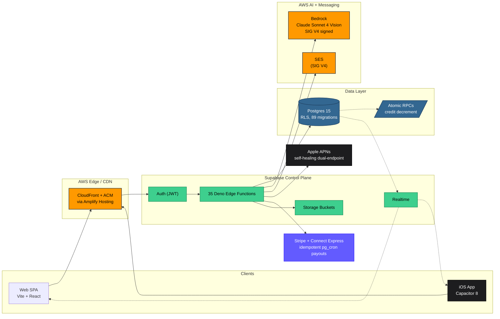

# Swing Institute — Architecture Reference

> Production athlete-development SaaS. Web, iOS App Store, and PWA from a single TypeScript codebase, with an AWS Bedrock vision pipeline (Claude Sonnet 4) that returns biomechanical scorecards from a phone-recorded swing in about eight seconds. Coaching marketplace with Stripe Connect Express payouts. Live with MLB players, college athletes, and youth prospects.

[](https://www.swinginstitutebaseball.com)
[](https://www.apple.com/ios/)
[](https://supabase.com)
[](https://aws.amazon.com/bedrock/)
[](https://stripe.com/connect)

This repository is the public architecture reference for Swing Institute. The application code lives in a private repo. The intent here is to give engineers, architects, and hiring managers a clear read on the system design, the decisions behind it, and the build history without needing source access.

---

## At a glance

| Area | What's in production |
|---|---|
| AI pipeline | Apple Vision (Neural Engine) on iOS, MediaPipe Tasks Vision in the browser, both normalized to a single 33-landmark coordinate space. The client picks 8–12 keyframes and only those upload. AWS Bedrock vision (Claude Sonnet 4) returns structured biomechanical JSON in about eight seconds. |
| Concurrency safety | Postgres atomic RPC (`decrement_deep_ai_credit` and siblings) eliminates the TOCTOU race that occurs when two devices upload at the same time. |
| Authorization | Supabase JWT for identity, a `user_roles` table with admin-only mutation, row-level security on every user-scoped table, and per-function ownership checks. |
| Notifications | APNs push, SES email, and in-app realtime running in parallel. Self-healing dual-endpoint APNs: sandbox first, retry production on failure, delete the token if both fail. |
| Payouts | Stripe Connect Express via pg_cron job (`WHERE stripe_transfer_id IS NULL`), partial-failure-safe by construction. A daily reconciliation job walks the Stripe event stream to repair webhook drift. |
| Operations | A custom launch-readiness dashboard with 13 automated checks as a single pane of glass. |
| Migration plan | Phased path to AWS-native: frontend, then auth (Cognito), then data (Aurora Serverless v2 via AWS DMS logical replication), then functions (Lambda + API Gateway HTTP v2). |
| Related work | A second production SaaS, [Terrava](https://github.com/jashabalcom/terrava-architecture), runs the AWS-native CDK stack already (14 stacks, 77 Lambda functions, Bedrock RAG). |

---

<p align="center">
  
  
  
</p>
<p align="center">
  
  
  
</p>

---

## What this platform actually does

| Product surface | Capability |
|---|---|
| **AI Swing Analysis** | Client-side frame extraction (MediaPipe on web, Apple Vision on iOS 14+) → 8–12 JPEG key-frames → AWS Bedrock (Claude Sonnet 4 vision, SIG V4 signed) → structured biomechanical JSON → 0–100 overall score, 5 category scores, 15+ measured metrics, pro-comparison. |
| **Coaching Marketplace** | Coach profiles, availability, Stripe Connect Express onboarding, GPS-verified check-in, mutual confirmation, atomic session payouts. |
| **Academy** | Multi-level curriculum (Levels → Modules → Lessons), video hosting, progress tracking, drill-of-the-week. |
| **Live Session Room** | Daily.co WebRTC rooms with session scheduling, reminders, auto-transcription. |
| **Community** | Posts, comments, DMs, group chats, reactions, polls, mentions, moderation queue, 3-channel notifications. |
| **Parent Dashboard** | COPPA-compliant child accounts, parent verification, multi-child rosters, session snapshots. |
| **Partner Programs** | 4 landing pages (Coach / NIL / Ambassador / Affiliate) with variant-aware forms, admin review queue, referral attribution, commission tracking. |
| **Admin Surface** | 20+ admin pages — members, coaches, schedule, payroll, revenue, moderation, launch-readiness dashboard with 13 automated checks. |

---

## Engineering notes

A few of the harder problems and how they were solved.

**A hybrid AI pipeline that bills per image, not per video.** Pose detection runs on-device — Apple's `VNDetectHumanBodyPoseRequest` on the Neural Engine for iOS, MediaPipe Tasks Vision in the browser for web. Both normalize to the same 33-landmark coordinate space so downstream code has one path. The client then picks 8–12 keyframes (stance, load, contact, follow-through) and only those get uploaded. Bedrock charges per image, so the request is images and not video. Inference cost is decoupled from clip length.

**No double-spend on AI credits.** Two simultaneous uploads from iPhone and iPad shouldn't both decrement the same credit. The fix is a Postgres `RPC` (`decrement_deep_ai_credit`) that atomically reads and decrements in a single transaction. No TOCTOU race is possible at the application layer.

**Push notifications survive the App Store / dev-build divide.** APNs tokens silently change between sandbox (TestFlight, dev) and production (App Store) builds. The `send-push` edge function tries sandbox first, retries production on failure, and deletes the dead token if both fail. After this change, delivery climbed to roughly 100%.

**Stripe webhook is the source of truth.** The browser success page is UX — it subscribes to the database row flipping but it does not write. Coach payouts run as an idempotent pg_cron job (`WHERE stripe_transfer_id IS NULL`). A daily reconciliation walks Stripe's event stream to repair webhook drift. Belt and suspenders, both required at non-trivial volume.

---

## Architecture at a glance



**Full architecture deep-dive (with sequence flows + ERD):** [docs/PORTFOLIO/ARCHITECTURE.md](docs/PORTFOLIO/ARCHITECTURE.md)

---

## AI swing-analysis sequence

```mermaid
sequenceDiagram
    autonumber
    participant U as Athlete (iOS / Web)
    participant C as Client (Capacitor / Vite)
    participant V as On-device Vision<br/>(Apple Vision / MediaPipe)
    participant E as Edge Fn (Deno)
    participant DB as Postgres + RLS
    participant B as AWS Bedrock<br/>(Claude Sonnet 4 Vision)

    U->>C: Record swing
    C->>V: Run pose detection on-device<br/>(Neural Engine / WebGPU)
    V-->>C: 33-landmark layout per frame
    C->>C: Pick 8-12 keyframes<br/>(stance / load / contact / follow-through)
    C->>E: POST /analyze<br/>{clip_id, jpeg keyframes}
    E->>E: Verify JWT + ownership
    E->>DB: rpc('decrement_deep_ai_credit')<br/>atomic, no TOCTOU
    DB-->>E: ok / 402 if no credits
    E->>B: SIG V4 InvokeModel<br/>(Sonnet 4 Vision + system prompt with MLB benchmarks)
    B-->>E: structured biomechanical JSON
    E->>DB: persist clip.ai_score / category_scores
    DB-->>C: realtime event (clip updated)
    C-->>U: render scorecard + recommendations

    Note over E,B: Credits stay decremented if Bedrock fails<br/>Bedrock billed; we accept this as a small loss vs<br/>holding a credit-lock during a 3-8s call.
```

> Want a hero-grade static diagram with the official AWS Architecture Icons? Build one in [Excalidraw](https://excalidraw.com) (it has an AWS icon library) or [draw.io](https://app.diagrams.net) (full AWS shape pack), export to PNG/SVG, and reference it as `docs/PORTFOLIO/screenshots/arch-hero.png`. Mermaid renders inline; static art is sharper for the hero.

---

## Cost engineering — running production for ~$100/month

| Decision | Why | Result |
|---|---|---|
| **On-device pose detection** | Apple Neural Engine + MediaPipe in-browser are free | $0 inference cost on the heavy step |
| **Keyframe selection client-side** | Bedrock vision charges per image | Cost decoupled from clip length — every clip is 8–12 images |
| **Supabase as control plane** | One vendor for Auth + Postgres + Storage + Edge + Realtime ≈ a month of bespoke AWS plumbing for a solo team | First $25 MAU bracket fits inside Free tier |
| **AWS Bedrock for vision (only)** | Sonnet 4 Vision is the right model for benchmarked biomechanics; pay per request, no infra | Predictable per-analysis cost |
| **AWS SES for email (SIG V4 from edge)** | $0.10 / 1,000 emails vs $20+/mo for managed providers | Email infra essentially free at this scale |
| **CloudFront + Amplify Hosting** | TLS + global CDN + branch previews out of the box | Free tier covers SPA bandwidth |
| **pg_cron for jobs** | Volume doesn't justify SQS+Lambda yet; idempotent cron is simpler | One less service to operate |

Total infra: **~$100/month at <500 MAU.** Documented AWS-native migration path (Aurora Serverless v2, Lambda, Cognito, EventBridge) when scale or compliance forces the move.

---

## Tech stack

**Frontend** — Vite 6, React 18, TypeScript, TailwindCSS 3, shadcn/ui (Radix primitives), Framer Motion, TanStack Query, React Router v6, Zod, React Hook Form.

**Mobile** — Capacitor 8, native Swift plugins (Apple Vision pose detection, Sign in with Apple), APNs push, Capacitor Preferences bridge for auth storage.

**Backend** — Supabase Postgres (89 migrations, Row-Level Security), 35 Deno Edge Functions, Supabase Storage (video buckets, partner-application bucket with 100 MB limit), Realtime for notifications and presence.

**AI / ML** — AWS Bedrock (Claude Sonnet 4 vision) via `aws4fetch` SIG V4 signing, MediaPipe Tasks Vision (web), Apple `VNDetectHumanBodyPoseRequest` (iOS native), MediaPipe-compatible coordinate-space adapter so both paths feed the same downstream code.

**Payments** — Stripe Checkout, Stripe Connect Express (coach payouts), Stripe Customer Portal, atomic credit-consumption RPCs, webhook signature verification, reconciliation job.

**Email** — AWS SES with SIG V4 signing, 80+ branded transactional templates across 15 template codes.

**Notifications** — 3-channel delivery (APNs push, SES email, in-app Postgres row + realtime) with self-healing dual-endpoint APNs (sandbox + production retry, automatic token cleanup).

**Video** — Daily.co for live coaching rooms, auto-transcription edge function.

**CRM** — GoHighLevel sync on signup.

**Observability** — Sentry for frontend error tracking, Postgres-backed health edge function, pg_cron scheduled jobs (payouts, reminders, cleanup), custom launch-readiness dashboard.

**Testing** — Vitest unit tests, Playwright E2E for partner-application flows.

**CI/CD** — GitHub Actions (`.github/workflows/deploy.yml`), AWS Amplify branch previews.

---

## Repository stats

| Metric | Count |
|---|---|
| Git commits (main) | **564** |
| React pages (route entry points) | **87** |
| Edge functions (Deno) | **35** |
| Postgres migrations | **89** |
| Email templates | **80+** |
| Admin dashboards | **20+** |
| Custom React hooks | **40+** |

---

## Security & compliance posture

- Row-Level Security on every user-scoped table; service-role key never leaves edge functions
- JWT verification + ownership checks on every AI analysis request
- Atomic credit decrement via Postgres RPC (`decrement_deep_ai_credit`, `decrement_hybrid_credit`, `decrement_group_credit`) — no read-then-write races
- Stripe webhook signature verification, dedicated reconciliation job
- COPPA-compliant parent/child flow with out-of-band email verification
- FTC-safe disclaimers on affiliate/NIL landing pages
- Protected surfaces (notification system, credit RPCs, Stripe webhook) marked in `CLAUDE.md` with explicit change-control guidance
- Privacy policy in `docs/legal/privacy-policy.md`, iOS privacy manifest at `ios/App/App/PrivacyInfo.xcprivacy`

---

## AWS-native migration plan (documented)

Today's infra is ~$100/month at <500 MAU. The plan when scale or compliance forces the cutover:

1. **Frontend** — Already on Amplify Hosting + CloudFront + ACM. No move required. ✅
2. **Auth** — Supabase Auth → **Cognito User Pool** with MFA. Migrate user records via the standard Cognito user-pool import flow. (Riskiest cutover — staged with shadow auth before flip.)
3. **Data** — Supabase Postgres → **Aurora PostgreSQL Serverless v2** via **AWS DMS logical replication**. Same SQL — migrations run unmodified. Read replica for reporting. RDS Proxy for connection multiplexing.
4. **Functions** — Deno Edge Functions → **Lambda + API Gateway HTTP v2** (Node 20, ARM64/Graviton2). Code is standard TypeScript; the port is mostly packaging.
5. **Storage** — Already S3-semantic via Supabase. Migration is `aws s3 sync`.
6. **Async** — pg_cron → **EventBridge Scheduler + SQS DLQs**.
7. **AI** — Already on Bedrock. ✅
8. **Email** — Already on SES. ✅
9. **Observability** — Sentry remains; add **CloudWatch Synthetics + X-Ray + Budgets** (mirror of the Terrava pattern).

Detailed plan in [docs/AWS-DEPLOYMENT-PLAN.md](docs/AWS-DEPLOYMENT-PLAN.md). Pattern proven in [Terrava](https://github.com/jashabalcom/terrava-architecture) — 14 CDK stacks already production.

---

## Related project — Terrava

A second production SaaS by the same author. [Terrava](https://github.com/jashabalcom/terrava-architecture) is a multi-tenant wealth and real-estate intelligence platform on the AWS-native pattern: 14 CDK stacks, 77 Lambda functions on Graviton2, Aurora Serverless v2, Bedrock multi-model router with RAG, OpenSearch Serverless, Stripe across eight tiers. The two projects are intentionally built on different stacks. Swing Institute uses a leaner Supabase + AWS edge pattern; Terrava uses the full AWS-native CDK pattern. Choice of stack tracks team size, compliance posture, and cost-of-build vs cost-of-scale.

---

## Portfolio documentation

For a senior-engineer / solutions-architect walk-through of this codebase:

- **[ARCHITECTURE.md](docs/PORTFOLIO/ARCHITECTURE.md)** — system design, data flow diagrams, trust boundaries, scalability posture
- **[ENGINEERING-DECISIONS.md](docs/PORTFOLIO/ENGINEERING-DECISIONS.md)** — ADR-style decision log (pros, cons, alternatives considered)
- **[BUILD-TIMELINE.md](docs/PORTFOLIO/BUILD-TIMELINE.md)** — stage-by-stage, what shipped when and why
- **[INTERVIEW-GUIDE.md](docs/PORTFOLIO/INTERVIEW-GUIDE.md)** — how to walk a hiring manager through this project
- **[SCREENSHOTS.md](docs/PORTFOLIO/SCREENSHOTS.md)** — portfolio shot list

Additional infra planning: [docs/AWS-DEPLOYMENT-PLAN.md](docs/AWS-DEPLOYMENT-PLAN.md).

---

## Local development

```bash
# Prereqs: Node 20+, pnpm or npm, Supabase CLI

npm install
cp .env.example .env              # add VITE_SUPABASE_URL and VITE_SUPABASE_PUBLISHABLE_KEY
npm run dev                       # http://localhost:8080
npm run build                     # production build → dist/
npm run test                      # Vitest
npx playwright test               # E2E

# iOS
npm run build && npx cap sync ios
npx cap open ios                  # opens Xcode
```

Required env vars are in `.env.example`. Additional secrets (Bedrock IAM, SES, APNs key, Stripe keys, GHL token, Daily.co key) live in Supabase function secrets.

---

## Author

**Jasha Balcom** — Solutions Architect & Full-Stack Engineer. Sotheby's International Realty Global Real Estate Advisor. FINRA Series 7 / Series 66. Former Chicago Cubs prospect and MLB performance coach. AWS Certified Cloud Practitioner.

- Live: [swinginstitutebaseball.com](https://www.swinginstitutebaseball.com)
- Related project: [terrava-architecture](https://github.com/jashabalcom/terrava-architecture)
- LinkedIn / contact: see GitHub profile
