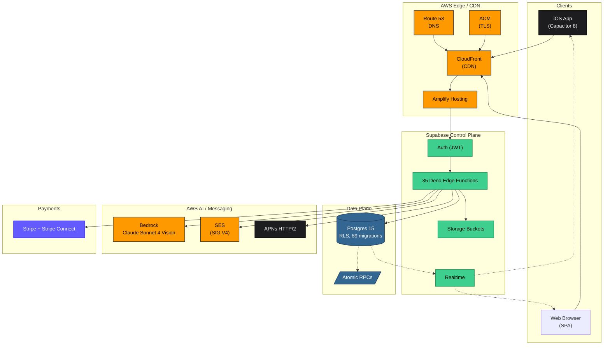

# Swing Institute — Architecture Reference

**Public architecture + decision record for a production baseball-training SaaS (web + iOS).**

The application code lives in a private repository. This repo exists so engineers, architects, and hiring managers can read the system design, the decisions behind it, and the build history without needing source access.

---

## What this platform is

Swing Institute is a full-stack athlete-development platform used by MLB players, collegiate athletes, and youth prospects. It combines:

- An **AI swing-analysis engine** (phone video → AWS Bedrock Claude Sonnet 4 Vision → MLB-benchmarked biomechanical scorecard in ~8 s).
- A **coaching marketplace** with Stripe Connect Express payouts, GPS-verified check-in, and mutual session confirmation.
- An **on-demand academy** (Levels → Modules → Lessons, progress tracking).
- A **live-session WebRTC room** (Daily.co) with transcription.
- A **community layer** (posts, DMs, group chats, polls, moderation).
- A **parent dashboard** with COPPA-compliant child accounts.
- Four **partner-program landing pages** (Coach / NIL / Ambassador / Affiliate) with variant-driven components.
- A **20-page admin surface** including a launch-readiness dashboard with 13 automated checks.

Single TypeScript codebase → web (AWS Amplify + CloudFront) + iOS App Store (Capacitor 8) + PWA.

---

## Architecture at a glance

Branded fill colors: AWS orange, Supabase green, Stripe purple, Postgres blue, Apple charcoal. Full architecture with 6 diagrams (logical, physical, AI sequence, payout sequence, notification fan-out, ERD) in [ARCHITECTURE.md](ARCHITECTURE.md).

> For a hero-grade static asset using the **official AWS Architecture Icons** (PNG/SVG from <https://aws.amazon.com/architecture/icons/>), build it once in [Excalidraw](https://excalidraw.com) or [draw.io](https://app.diagrams.net) (full AWS stencil pack), export, and embed inline.

---

## Read this repo in order

1. **[ARCHITECTURE.md](ARCHITECTURE.md)** — system design deep dive: logical architecture, physical AWS topology, request flows, data model, trust boundaries, scalability posture, observability.
2. **[ENGINEERING-DECISIONS.md](ENGINEERING-DECISIONS.md)** — 14 ADRs. Each decision has context, alternatives considered, trade-offs accepted, and current status.
3. **[BUILD-TIMELINE.md](BUILD-TIMELINE.md)** — 18-stage narrative of what shipped and why, drawn from 564 commits on `main`.
4. **[AWS-DEPLOYMENT-PLAN.md](AWS-DEPLOYMENT-PLAN.md)** — phased migration plan from the current Supabase/Amplify setup to AWS-native (Aurora Serverless v2, Lambda, API Gateway, Cognito) when scale demands it.

---

## Tech stack

| Concern | Choice |
|---|---|
| Frontend | Vite 6, React 18, TypeScript, TailwindCSS 3, shadcn/ui, TanStack Query, React Router v6 |
| Mobile | Capacitor 8 + native Swift plugins (Apple Vision pose detection, Sign in with Apple) |
| Backend | 35 Deno Edge Functions on Supabase |
| Database | Postgres 15 with Row-Level Security, 89 forward-only migrations, pg_cron for scheduled jobs |
| AI / ML | AWS Bedrock (Claude Sonnet 4 vision) via `aws4fetch` SIG V4; MediaPipe Tasks Vision (web); Apple `VNDetectHumanBodyPoseRequest` (iOS) |
| Payments | Stripe Checkout, Stripe Connect Express, Customer Portal, atomic credit RPCs, signed webhooks, daily reconciliation |
| Email | AWS SES with SIG V4 signing, 80+ branded transactional templates |
| Push | Apple APNs HTTP/2 direct, dual sandbox + production endpoint retry, auto dead-token cleanup |
| Live video | Daily.co WebRTC rooms + transcription |
| CRM | GoHighLevel sync on signup |
| Hosting | AWS Amplify + CloudFront + ACM + Route 53 |
| Observability | Sentry; custom launch-readiness dashboard with 13 automated checks |
| Testing | Vitest, Playwright (E2E on partner-application flows) |

---

## Scale and cost posture

**Launch tier (0–500 MAU):** ~$75–130/mo total across AWS + Supabase + Stripe (variable).

**Phase-2 target (500–5000 MAU):** migrate to AWS-native per [AWS-DEPLOYMENT-PLAN.md](AWS-DEPLOYMENT-PLAN.md). Order: frontend → auth → data → functions. AWS DMS handles logical replication during DB cutover.

---

## What this demonstrates

This codebase is the reference point for:

- **Solutions architecture** — multi-service AWS design, edge-first backend, phased cloud migration plan.
- **Production engineering** — atomic concurrency, webhook-as-source-of-truth payments, idempotent scheduled jobs, self-healing push delivery.
- **Product engineering** — one codebase to three platforms, hybrid on-device + cloud AI pipeline, RBAC with RLS enforced at the database layer.
- **Operational rigor** — 89 migrations without breakage, 14 ADRs, a launch-readiness dashboard that turns go/no-go into a single pane of glass.

---

## Author

**Jasha Balcom** — Solutions Architect & Full-Stack Engineer. Former Chicago Cubs prospect and MLB performance coach. AWS-certified cloud practitioner.

- Live product: [swinginstitutebaseball.com](https://www.swinginstitutebaseball.com)
- Private application repo: `jashabalcom/swinginsitute` (access on request)
